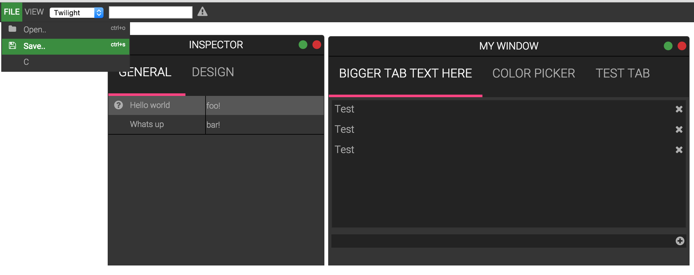

# apphammer
**UI library for WebApps - powering Apma**

Started as a long-term refactoring effort aimed at pulling out nasty UI code from Flux, and putting it in a more generic toolkit.

The goal is to offer a full set of webapp-oriented components and systems implemented in a straight-forward, clean, and compact way.

Apphammer borrows heavily from Material Design concepts, and utilizes Font Awesome for the default icon set.

Part of the goal is also to keep apps using apphammer to javascript only. No HTML/CSS or other markup should be required.
To this end, apphammer has a very flexible composing system, which allows apps to define its entire UI/UX in the form of short and sweet JavaScript snippets.

# Hello World
The following shows how to create an application consisting of a toolbar with a file menu attached to it, and a couple of icons:
    
    ah.ui.part({
      name: 'MainToolbar',
      type: 'toolbar', //toolbar, window
      //Left icons
      left: [
        'MainFileMenu' //reference to other part  
      ],
      //Right icons
      right: [
        {
          icon: 'user', 
          click: ah.ui.part('UserDropdown').activate
        },
        {
          icon: 'gear',
          click: ah.ui.part('AppSettings').activate
        }
      ]
    });
    
    ah.ui.part({
      name: 'MainFileMenu',
      type: 'FileMenu',
      options: {
        'FILE': [
          {
            title: 'Open',
            click: ah.ui.part('OpenApp').activate
          }
        ],
        'VIEW': [...],     
        'PUBLISH': [...],        
        'HELP': [...]        
      }    
    });
    
    
    
# Front-end Library

## Implemented UI Components
  * Accordion
  * Context Menu
  * Color Picker
  * Filemenu
  * List
  * Property Grid (tied to sync store)
  * Property Grid (tied to javascript objects)
  * Searchable Tree
  * Sidemenu
  * Snackbar
  * Searchable Tree
  * Toolbar
  * Tab control
  * Tree
  * Vertical Splitter
  * Horizontal Splitter
  * Window

## Implemented Helpers
  * Mover
  * Resizer
  * Catcher
  * Hotkey Manager
  * Drag 'n Drop
  * Pretty tooltipifier

## Implemented Systems
  * DOM interface (ah.dom)
  * SyncStore - data store with collaboration features

# License

[MIT](LICENSE)
